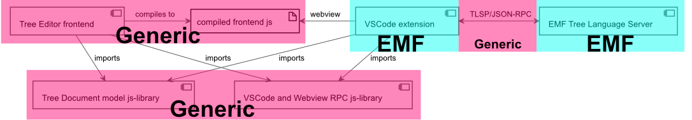

# VSCode Ecore Tree Editor


## Components

1. VSCode extension (`vscode-ecore-tree-editor-extension`)
2. Tree Editor frontend (`tree-editor-frontend`)
3. Tree Language Server (`nil/TODO`)
4. Ecore Model Server (`model-server`)

The VSCode extension embeds and presents the Tree Editor frontend. The extension talks over the Tree Language Server Protocol (TLSP) to the Tree Language Server, which in turn asks the Ecore Model Server to do the actual work on models and files.

```plantuml
[VSCode extension] as VSCEx
[Tree Editor frontend] as TEf
[Tree Language Server] as TLS
[Ecore Model Server] as EMS

artifact "compiled frontend js" as cfs

TEf -> cfs : compiles to
VSCEx --> cfs : webview
VSCEx <-> TLS : TLSP
TLS <-> EMS : REST, Websocket
```

## Generic and specific domains
Some parts are generic to all domains suited for a Tree Editor. The rest is specific to Eclipse Modeling Framework (EMF).

Generic components should not contain *any* references to EMF or Ecore.


