# Tree document model js

This library is meant for the web editor frontend.
The library is not published, and will be installed in the editor-frontend using `npm` with a file path.

The main data structure is the TreeDocument.

## Example model: Ecore instance as Tree Document

```plantuml
@startjson
{
  "roots": [
    {
      "id": "./test-model/MyEcore.ecore",
      "rootNode": {
        "id": "_NOhYAKm8EeuBaMJVipwwMw",
        "type": "EPackage",
        "name": "MyEcore",
        "children": [
          {
            "id": "_NOkbUKm8EeuBaMJVipwwMw",
            "type": "EClass",
            "name": "TestClass",
            "documentation": "This is the main class. Kristian is cool",
            "children": [
              {
                "id": "_NOkbUam8EeuBaMJVipwwMw",
                "type": "EAnnotation",
                "name": "http://www.eclipse.org/emf/2002/Ecore",
                "children": []
              },
              {
                "id": "_NOkbUqm8EeuBaMJVipwwMw",
                "type": "EAnnotation",
                "name": "http://www.eclipse.org/emf/2002/GenModel",
                "children": [
                  {
                    "id": "_NOkbU6m8EeuBaMJVipwwMw",
                    "type": "EStringToStringMapEntry",
                    "name": "documentation",
                    "children": []
                  }
                ]
              },
              {
                "id": "_NOlCYKm8EeuBaMJVipwwMw",
                "type": "EOperation",
                "name": "myOperation",
                "children": [
                  {
                    "id": "_NOlCYam8EeuBaMJVipwwMw",
                    "type": "EGenericType",
                    "name": "EString",
                    "children": []
                  }
                ]
              },
              {
                "id": "_NOlpcKm8EeuBaMJVipwwMw",
                "type": "EAttribute",
                "name": "MyAttribute",
                "children": [
                  {
                    "id": "_NOlpcam8EeuBaMJVipwwMw",
                    "type": "EGenericType",
                    "name": "EInt",
                    "children": []
                  }
                ]
              },
              {
                "id": "_NOm3kKm8EeuBaMJVipwwMw",
                "type": "EReference",
                "name": "MyReference",
                "children": [
                  {
                    "id": "_NOm3kam8EeuBaMJVipwwMw",
                    "type": "EGenericType",
                    "name": "TestClass",
                    "children": []
                  }
                ]
              },
              {
                "id": "_NOm3kqm8EeuBaMJVipwwMw",
                "type": "EReference",
                "name": "me",
                "children": [
                  {
                    "id": "_NOm3k6m8EeuBaMJVipwwMw",
                    "type": "EGenericType",
                    "name": "TestClass",
                    "children": []
                  }
                ]
              },
              {
                "id": "_NOm3lKm8EeuBaMJVipwwMw",
                "type": "EAttribute",
                "name": "meToo",
                "documentation": "Very cool!",
                "children": [
                  {
                    "id": "_NOm3lqm8EeuBaMJVipwwMw",
                    "type": "EAnnotation",
                    "name": "http://www.eclipse.org/emf/2002/GenModel",
                    "children": [
                      {
                        "id": "_NOm3l6m8EeuBaMJVipwwMw",
                        "type": "EStringToStringMapEntry",
                        "name": "documentation",
                        "children": []
                      }
                    ]
                  },
                  {
                    "id": "_NOm3lam8EeuBaMJVipwwMw",
                    "type": "EGenericType",
                    "name": "EJavaObject",
                    "children": []
                  }
                ]
              }
            ]
          },
          {
            "id": "_NOm3mKm8EeuBaMJVipwwMw",
            "type": "EDataType",
            "name": "MyEnum",
            "children": []
          },
          {
            "id": "_NOm3mam8EeuBaMJVipwwMw",
            "type": "EDataType",
            "name": "MyData",
            "children": []
          },
          {
            "id": "_NOneoKm8EeuBaMJVipwwMw",
            "type": "EClass",
            "name": "Circular",
            "children": [
              {
                "id": "_NOneoam8EeuBaMJVipwwMw",
                "type": "EReference",
                "name": "circularReference",
                "children": [
                  {
                    "id": "_NOneoqm8EeuBaMJVipwwMw",
                    "type": "EGenericType",
                    "name": "Circular",
                    "children": []
                  }
                ]
              }
            ]
          }
        ]
      },
      "actions": {
        "availableActions": [
          {
            "id": "ecore:dynamic-instance",
            "name": "Create dynamic instance"
          },
          {
            "id": "ecore:create-genmodel",
            "name": "Create genmodel file"
          }
        ],
        "defaultAcionbarActions": [
          "ecore:dynamic-instance"
        ],
        "nodeActions": {
          "EPackage": [
            "ecore:create-genmodel"
          ]
        }
      },
      "hierarchy": {
        "allowedChildren": {
          "EPackage": [
            "EClass",
            "EDataType",
            "EAnnotation"
          ]
        }
      }
    }
  ]
}
@endjson
```

PlantUML code

